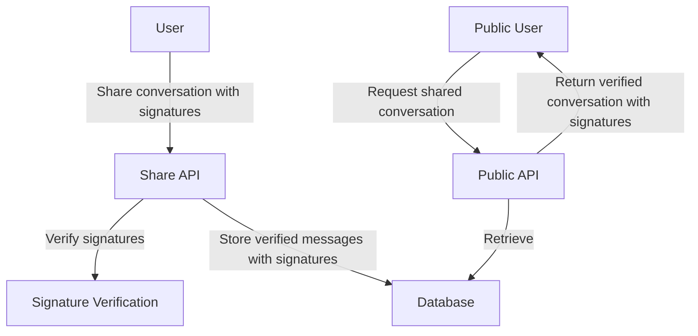

# Conversation Sharing Feature Plan

## Feature Overview

This feature will allow users to share their conversations with the outside world through public endpoints. The shared conversations will be read-only, with signatures verified to ensure authenticity.

## Database Design

We'll extend the database schema to support shared conversations by creating a new model called `SharedChat`:

```prisma
model SharedChat {
  id          String   @id @default(uuid())
  chatId      String   // Reference to the original chat
  ownerId     String   // Owner's user ID
  title       String
  description String?
  createdAt   DateTime @default(now())
  messages    String   // JSON blob of all messages including their signatures
}
```

For shared conversations, we'll store all messages as a JSON blob rather than individual rows. Since these conversations are read-only, we don't need the flexibility of individual message records, and a blob approach will be more efficient for retrieving the entire conversation at once. The messages blob will include the original signatures for each message.

## API Endpoints

We'll create the following endpoints:

1. **Share a conversation**

   - `POST /api/share`
   - Creates a new shared conversation entry
   - Requires authentication
   - Verifies all message signatures before sharing

2. **List shared conversations**

   - `GET /api/share`
   - Returns a paginated list of shared conversations
   - Public endpoint

3. **Get a specific shared conversation**
   - `GET /api/share/:id`
   - Returns a specific shared conversation by ID
   - Public endpoint

## Implementation Plan

Here's a diagram showing the overall architecture:



### 1. Database Schema Update

First, we'll update the Prisma schema to add the `SharedChat` model as described above.

### 2. API Implementation

We'll create a new controller called `ShareController.ts` with the following methods:

1. **shareChat**: Creates a new shared conversation

   - Takes a chat ID, title, and optional description
   - Retrieves the original chat and its messages with signatures
   - Verifies all message signatures using the existing method in ChatService
   - Stores the shared chat with verified messages and their signatures in the database

2. **listSharedChats**: Lists shared conversations with pagination

   - Takes optional page and limit parameters
   - Returns a paginated list of shared chats with basic metadata

3. **getSharedChat**: Gets a specific shared conversation
   - Takes a shared chat ID
   - Retrieves the shared chat from the database
   - Returns the shared chat with all messages and their signatures

### 3. Signature Verification

We'll use the existing signature generation method in ChatService (`generateSignature`) to verify the authenticity of each message in the conversation at sharing time. This ensures that the messages haven't been tampered with. The signatures will be stored along with the messages in the shared chat, as they're needed when someone copies the shared chat to their own message threads.

### 4. Frontend Integration (Not part of this task)

The frontend will need to add:

- A share button on conversations
- A UI for viewing shared conversations
- Functionality to copy a shared conversation to a new chat (using the stored signatures)

## Implementation Details

### Database Storage Approach

For the `messages` field in the `SharedChat` model, we'll store a JSON blob containing:

- All message contents
- Timestamps
- Role information (user/assistant)
- Original signatures for each message

This approach is more efficient for read-only shared conversations than storing individual message records.

### Pagination

The list endpoint will support pagination with:

- Default limit of 50 items per page
- Page number parameter
- Total count in the response

### Error Handling

We'll implement proper error handling for:

- Invalid chat IDs
- Unauthorized access attempts
- Failed signature verification (if any message signature is invalid, the sharing operation should fail)

## Security Considerations

1. **Signature Verification**: We'll verify signatures for each message to ensure message authenticity
2. **Rate Limiting**: Apply rate limiting to prevent abuse of the public endpoints
3. **Content Validation**: Ensure shared content doesn't contain sensitive information
